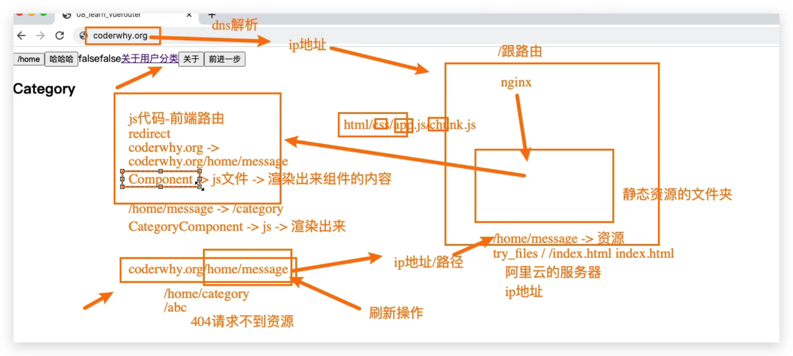
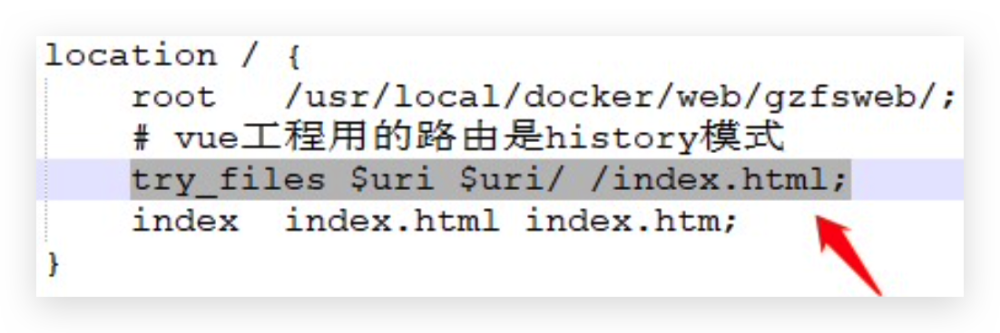

# historyApiFallback

前端路由：

* historyApiFallback是开发中一个非常常见的属性，它主要的作用是**解决SPA页面在路由跳转**之后，进行**页面刷新**时，返回404的错误。

* boolean值:默认是false。如果设置为true，那么在刷新时，返回404错误时，会自动返回 index.html 的内容;

* object类型的值，可以配置rewrites属性。可以配置from来匹配路径，决定要跳转到哪一个页面;

* 事实上devServer中实现historyApiFallback功能是通过connect-history-api-fallback库的。可以查看[connect-history-api-fallback](https://github.com/bripkens/connect-history-api-fallback) 文档

* Nginx 配置

  

